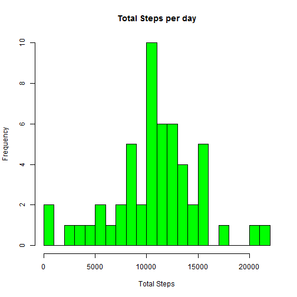
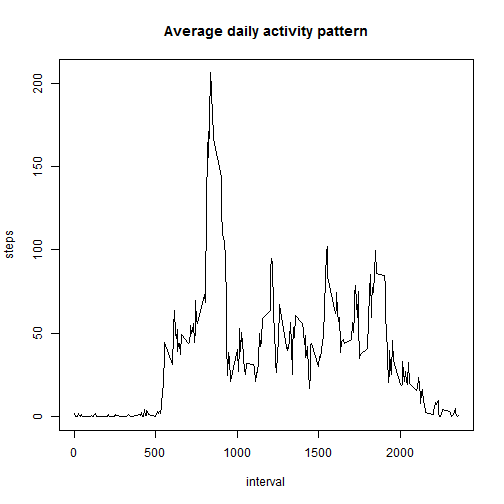
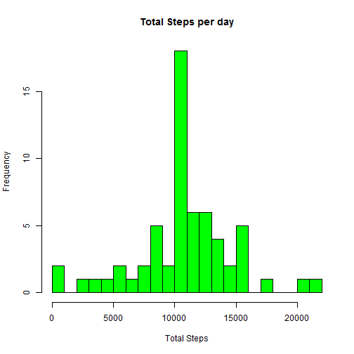

First Fork/clone the GitHub repository created for this assignment into RepData_PeerAssessment1 folder.

## Loading and preprocessing the data


```r
setwd("c:\\Data\\library\\R\\ReproducibleReaserch\\RepData_PeerAssessment1")

unzip("activity.zip")
activity <- read.csv("activity.csv")
activity$date <- as.Date(activity$date, format="%Y-%m-%d")
```


## What is mean total number of steps taken per day?


```r
totSteps <- aggregate(activity$steps, list(activity$date), sum)
names(totSteps) <- c("date","steps")

totalStepsMean <- mean(totSteps$steps, na.rm=T)
totalStepsMedian <- median(totSteps$steps, na.rm=T)

hist(totSteps$steps, col = "green", breaks = 20, 
     main="Total Steps per day", xlab="Total Steps")
```

 

```r
totalStepsMean
```

```
## [1] 10766.19
```

```r
totalStepsMedian
```

```
## [1] 10765
```

## What is the average daily activity pattern?


```r
totSteps2 <- aggregate(activity$steps,list(activity$interval),mean,na.rm=T)
names(totSteps2) <- c("interval","steps")

maxTotalStepsInterval <- totSteps2[totSteps2$steps==max(totSteps2$steps),]

plot(totSteps2, type="l", main="Average daily activity pattern")
```

 

```r
maxTotalStepsInterval
```

```
##     interval    steps
## 104      835 206.1698
```

## Imputing missing values
Replacing NAs with the rounded mean for equivalent 5-minute interval

```r
activity3 <- activity
totalMissingValues <- sum(is.na(activity3$steps))

activity3$steps <- 
  ifelse(is.na(activity3$steps), 
         round(totSteps2[totSteps2$interval %in% activity3$interval,2]),
         activity3$step)

totSteps3 <- aggregate(activity3$steps, list(activity3$date), sum)
names(totSteps3) <- c("date","steps")

totalStepsMean3 <- mean(totSteps3$steps, na.rm=T)
totalStepsMedian3 <- median(totSteps3$steps, na.rm=T)

totalMissingValues
```

```
## [1] 2304
```

```r
hist(totSteps3$steps, col = "green", breaks = 20, 
     main="Total Steps per day", xlab="Total Steps")
```

 

```r
totalStepsMean3
```

```
## [1] 10765.64
```

```r
totalStepsMedian3
```

```
## [1] 10762
```

Imputing missing values using rounded means for equivalent 5-minute intervals does not have impact on the mean and median total number of steps taken per day. Also shape of the histogram is the same. The only difference is higher frequency on some values.

## Are there differences in activity patterns between weekdays and weekends?

```r
activity3$daytype <- as.factor(ifelse(weekdays(activity3$date,abbreviate=T) %in% c("Sat","Sun"), 
                                      "weekend","weekday"))

totSteps4 <- aggregate(activity3$steps,list(activity3$interval,activity3$daytype),mean)
names(totSteps4) <- c("interval","daytype","steps")


#par(mfrow = c(2, 1), mar = c(0, 4, 2, 1))
#plot(totSteps4, type="l", main="wekend",xlab="",ylab="", xaxt="n", yaxt="n")
#plot(totSteps5, type="l", main="weekday")

library(lattice)
xyplot(totSteps4$steps ~ totSteps4$interval|totSteps4$daytype,totSteps4,type="l",
       layout=c(1,2),xlab="Interval",ylab="Number of steps")
```

 

Morning activity is higher for weekdays (longer sleep probably?).

Midday activity is higher for weekends (leisure activity compared to more siting at work?)

Evening activity is higher for weekends (some entertainment?). 


